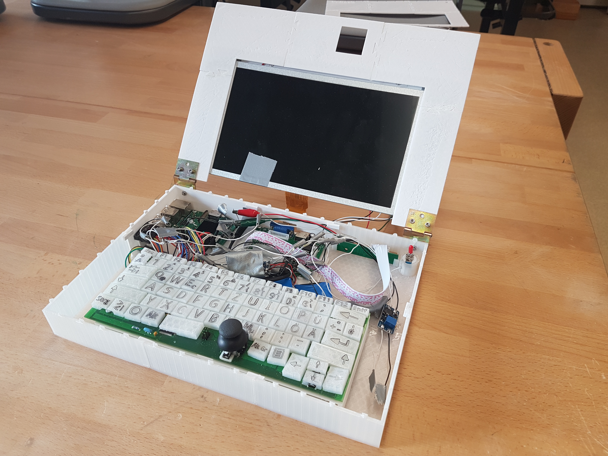

# PI-Book
This repository features the development of a new Raspberry Pi based mobile laptop. This new laptop is optimized by focusing on battery life instead of computing power. A solar panel is used as well to guarantee the energy supply in areas with no access to electricity. Additionally we implemented several interfaces that are not usually found in modern laptops but are very effective for measuring and development such as a RS 232 port, I2C, or a few raw GPIO pins. The product itself could become a cost-efficient solution for developing countries.

[Building instructions](BUILDING_INSTRUCTIONS.md)

[German paper](PAPER_german.pdf)
